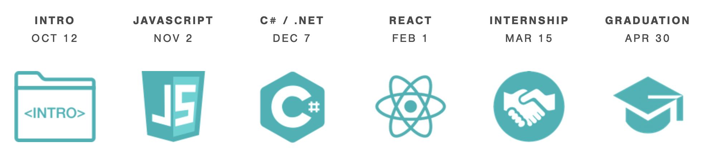

# _Tyler Sinks's portfolio index_

### By _**Tyler Sinks**_
* what the author looked like when he started this project

### _This Project's Reason for Being and Description_
_This project functions as a jumping off point to explore some of the work Tyler has begun in the realm of web development and software engineering_
* Created October 16, 2020
* Last major revision October 16, 2020
* Hopes to flex some just-learned skills touched on in the first week of Epicodus's October 2020 cohort:
* a cohort which runs from October 12, 2020 through April 30, 2021
* the Epicodus program includes the following modules *(with start dates)*

* initially created in response to a project prompt to be ginned up completely solo and completely within a nine hour window on **"created date"**

A list of projects you have created with active links to their GitHub pages sites or GitHub repositories.
For each, include a brief description of the project and what languages it uses.

## Setup/Installation Requirements
program setup instructions
link to site on GitHub Pages
* _In order to most easily view my portfolio, please [click this link](https://sinkstyt.github.io/portfolio-index/index.html)_
* _Should this link fail you in any way, you could alternatively copy and paste the full address below into a web browser's address bar:_
### https://sinkstyt.github.io/portfolio-index/index.html ###
* _No additional libraries or outside dependencies ought to be required to view this page_

## Known Bugs

_{Are there issues that have not yet been resolved that you want to let users know you know?  Outline any issues that would impact use of your application.  Share any workarounds that are in place. }_

## Support and Contact Details

_Please let me know of any suggestions to the page. I can be most easily reached by email._
_tyler.sinks@gmail.com_

## Technologies Used

_html_
_css_
_and a few drops of Bootstrap for styling_

### License

*MIT 2.0*

Copyright (c) 2020 **_Tyler Sinks_**